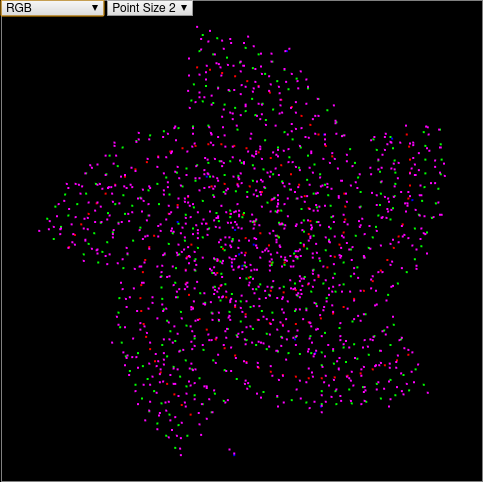

# galaxy-rs

This Rust crate is a port of [this](https://github.com/ChickenStorm/galaxy-gen)
galaxy generator. It generates spiral galaxies with random solar system
placement.

The builder starts building the frame of the galaxy by placing points following
a pattern defined by some parameters. It then populate each points on the frame
with a fixed number of solar systems randomly placer in the point's area.

## Generate a galaxy

To generate a galaxy, simply create a `petgraph::Graph` and populate it with a
`GalaxyBuilder`:

```Rust
use petgraph::Graph;
use galaxy_rs::GalaxyBuilder;

let mut galaxy = Graph::new();
GalaxyBuilder::default()
    .cloud_population(2) // number of systems for each frame point
    .nb_arms(5)          // number of spiraling arms 
    .nb_arm_bones(32)    // length of each arm (1 bone = 2cloud_radius)
    .slope_factor(0.4)   // factor for controling spiral slope decay
    .arm_slope(std::f64::consts::PI / 4.0) // initial slope angle of each arm
    .arm_width_factor(1.0 / 24.0)          // how wide the arm will expand
    .populate(Point { x:0f64, y:0f64 }, &mut frame); // build the galaxy
```

This code generates a galaxy which will look like this:

